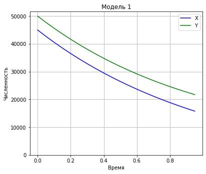
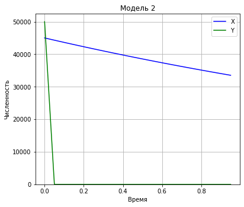

---
## Front matter
title: Лабораторная работа №3. Модель боевых действий
author: [Радикорский Павел Михайлович, НФИбд-03-18]
institute: "RUDN University, Moscow, Russian Federation"
date: 27.02.2021
lang: "ru"
## Formatting
toc: false
slide_level: 2
theme: metropolis
mainfont: PT Serif
romanfont: PT Serif
sansfont: PT Sans
monofont: Consolas
header-includes:
 - \metroset{progressbar=frametitle,sectionpage=progressbar,numbering=fraction}
 - '\makeatletter'
 - '\beamer@ignorenonframefalse'
 - '\makeatother'
aspectratio: 43
section-titles: true

---
# Цели и задачи

## Цель

Изучить виды модели боевых действий и реализовать программный код для её моделирования.

## Задачи

- изучить теорию о модели боевых действий
- реализовать программный код для 42 варианта

# Ход лабораторной работы

## Общие начальные данные

$x_0$ = 50000 - численность армии $X$

$y_0$ = 45000 - численность армии $Y$

## Первая модель

$$ \begin{cases}
\frac{dx}{dt} = -a(t)x(t)-b(t)y(t)+P(t)
\\
\frac{dy}{dt} = -c(t)x(t)-h(t)y(t)+Q(t)
\end{cases}
$$

## Реализация

Задаем начальные значения:

```python
x0 = 24000
y0 = 9500
t0 = 0 

tmax = 1
dt = 0.05

t = np.arange(t0,tmax,dt)

v0 = np.array([x0, y0])

a = 0.29
b = 0.67
c = 0.6
h = 0.38
```

## Реализация

Создаем функции для подхода подкрепления и функцию для СДУ:

```python
def P(t): 
    return abs(sin(t) + 1)

def Q(t):
    return abs(cos(t) + 1)

def derY1(y,t):
    dy1 = -a*y[0] - b*y[1] + P(t)
    dy2 = -c*y[0] - h*y[1] + Q(t)
    return [dy1, dy2]
```

## Реализация

Решаем систему и строим график:

```python
y = odeint(derY1, v0, t)
data1 = [y_i[0] for y_i in y]
data2 = [y_i[1] for y_i in y]

plt.plot(t, data1, 'b', label='X') 
plt.plot(t, data2, 'g', label='Y')
plt.title('Модель 1')
plt.xlabel('Время')
plt.ylabel('Численность')
plt.ylim(0, None)
plt.legend()
plt.grid(True)
plt.margins(0.05)
plt.subplots_adjust(left=0, bottom=0, right=0.8, top=1)
```

## Реализация - график первой модели

Изменения на графике идут равномерно у обеих армий (рис. 1).

{ #fig:001 width=60% }

## Вторая модель

$$ \begin{cases}
\frac{dx}{dt}= -a(t)x(t)-b(t)y(t)+P(t)
\\
\frac{dy}{dt}= -c(t)x(t)y(t)-h(t)y(t)+Q(t)
\end{cases}
$$

## Реализация

Задаем начальные значения:

```python
a = 0.31
b = 0.67
c = 0.42
h = 0.53
```

## Реализация

Меняем наши функции подкрепления и СДУ:

```python
def P(t):
    return 2*abs(sin(2*t))

def Q(t):
    return abs(cos(t)+1)

def derY2(y,t):
    dy1 = -a*y[0] - b*y[1] + P(t)
    dy2 = -c*y[0]*y[1] - h*y[1] + Q(t)
    return [dy1, dy2]
```

## Реализация

Решаем новую СДУ:

```python
y = odeint(derY2, v0, t)
dataset_1 = [y_i[0] for y_i in y]
dataset_2 = [y_i[1] for y_i in y]

plt.plot(t, dataset_1, 'b', label='X') 
plt.plot(t, dataset_2, 'g', label='Y')
plt.title('Модель 2')
plt.xlabel('Время')
plt.ylabel('Численность')
plt.ylim(0, None)
plt.legend()
plt.grid(True)
plt.margins(0.05)
plt.subplots_adjust(left=0, bottom=0, right=0.8, top=1)
```

## Реализация - график второй модели

Полученный результат выводим и сохраняем (рис. 2).

{ #fig:002 width=60% }

# Выводы

Были изучены модели боевых действий, а также была реализована практическая часть в виде реализации программного кода.

По построенным моделям можно судить, что при участии партизанских отрядов, армия Y понесет значительные потери, в отличие от первого случая, когда функции потерь обеих армий ведут себя приблизительно одинаково.