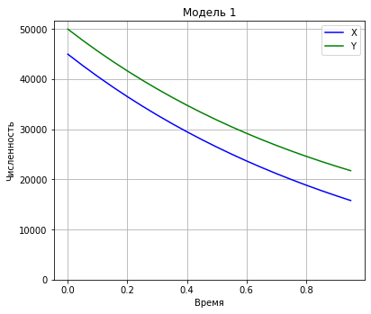
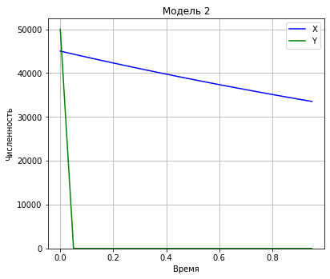

---
title: "Лабораторная работа №3. Модель боевых действий"
author: [Радикорский Павел Михайлович, НФИбд-03-18]
institute: "RUDN University, Moscow, Russian Federation"
date: "27.02.2021"
keywords: [Моделирование, Лабораторная]
lang: "ru"
toc-title: "Содержание"
toc: true # Table of contents
toc_depth: 2
lof: true # List of figures
fontsize: 12pt
mainfont: PT Serif
romanfont: PT Serif
sansfont: PT Sans
monofont: Consolas
mainfontoptions: Ligatures=TeX
romanfontoptions: Ligatures=TeX
sansfontoptions: Ligatures=TeX,Scale=MatchLowercase
monofontoptions: Scale=MatchLowercase
titlepage: true
titlepage-text-color: "000000"
titlepage-rule-color: "000000"
titlepage-rule-height: 0
listings-no-page-break: true
indent: true
header-includes:
  - \usepackage{sectsty}
  - \sectionfont{\clearpage}
  - \linepenalty=10 # the penalty added to the badness of each line within a paragraph (no associated penalty node) Increasing the value makes tex try to have fewer lines in the paragraph.
  - \interlinepenalty=0 # value of the penalty (node) added after each line of a paragraph.
  - \hyphenpenalty=50 # the penalty for line breaking at an automatically inserted hyphen
  - \exhyphenpenalty=50 # the penalty for line breaking at an explicit hyphen
  - \binoppenalty=700 # the penalty for breaking a line at a binary operator
  - \relpenalty=500 # the penalty for breaking a line at a relation
  - \clubpenalty=150 # extra penalty for breaking after first line of a paragraph
  - \widowpenalty=150 # extra penalty for breaking before last line of a paragraph
  - \displaywidowpenalty=50 # extra penalty for breaking before last line before a display math
  - \brokenpenalty=100 # extra penalty for page breaking after a hyphenated line
  - \predisplaypenalty=10000 # penalty for breaking before a display
  - \postdisplaypenalty=0 # penalty for breaking after a display
  - \floatingpenalty = 20000 # penalty for splitting an insertion (can only be split footnote in standard LaTeX)
  - \raggedbottom # or \flushbottom
  - \usepackage{float} # keep figures where there are in the text
  - \floatplacement{figure}{H} # keep figures where there are in the text
...

# Цели и задачи

**Цель:** Изучить виды модели боевых действий и реализовать программный код для её моделирования.

**Задачи:**

- изучить теорию о модели боевых действий
- реализовать программный код для 42 варианта

# Теоретическая справка

В теоретической части лабораторной работы рассмотрим все интерпретации модели боевых действий.

## Первая модель

$$ \begin{cases}
\frac{dx}{dt} =  -a(t)x(t) - b(t)y(t)+P(t)
\\
\frac{dy}{dt} =  -c(t)x(t) - h(t)y(t)+Q(t)
\end{cases},
$$

где $a(t)$ и $h(t)$ - параметры, описывающие влияние побочных факторов на потери во время боевых действий, а $b(t)$ и $c(t)$ - параметры эффективности боевых действий со стороны армий $Y$ и $X$.

## Вторая модель

Во втором случае в борьбу добавляются партизанские отряды. Нерегулярные войска в отличии от постоянной армии менее уязвимы, так как действуют скрытно, в этом случае сопернику приходится действовать неизбирательно, по площадям, занимаемым партизанами. Поэтому считается, что тем потерь партизан, проводящих свои операции в разных местах на некоторой известной территории, пропорционален не только численности армейских соединений, но и численности самих партизан.

$$ \begin{cases}
\frac{dx}{dt} =  -a(t)x(t) - b(t)y(t)+P(t)
\\
\frac{dy}{dt} =  -c(t)x(t)y(t) - h(t)y(t)+Q(t)
\end{cases}
$$

## Третья модель

$$ \begin{cases}
\frac{dx}{dt} =  -a(t)x(t) - b(t)x(t)y(t)+P(t)
\\
\frac{dy}{dt} =  -c(t)x(t)y(t) - h(t)y(t)+Q(t)
\end{cases}
$$

## Подготовка к реализации

Коэффициенты $a(t), b(t), c(t)$ и $h(t)$ будут постоянными для реализации лабораторной работы, т.к. иной вариант сложнее смоделировать.

# Программная реализация

При выполнении задания лабораторной работы использовался Вариант 42.

## Начальные данные

```python
import numpy as np
from math import cos, sin
from scipy.integrate import odeint
import matplotlib.pyplot as plt
```

```python
x0 = 45000
y0 = 50000
t0 = 0 

tmax = 1
dt = 0.05

t = np.arange(t0,tmax,dt)

v0 = np.array([x0, y0])
```

## Реализация моделей

### Модель №1

Зададим необходимые коэффициенты.


```python
a = 0.29
b = 0.67
c = 0.6
h = 0.38
```

Объявим функции $P(t)$ и $Q(t)$, функцию для СДУ.


```python
def P(t): 
    return abs(sin(t) + 1)

def Q(t):
    return abs(cos(t) + 1)

def derY1(y,t):
    dy1 = -a*y[0] - b*y[1] + P(t)
    dy2 = -c*y[0] - h*y[1] + Q(t)
    return [dy1, dy2]
```

Решим через `odeint` систему дифференциальных уравнений с помощью функции (рис. 1).


```python
y = odeint(derY1, v0, t)
data1 = [y_i[0] for y_i in y]
data2 = [y_i[1] for y_i in y]

plt.plot(t, data1, 'b', label='X') 
plt.plot(t, data2, 'g', label='Y')
plt.title('Модель 1')
plt.xlabel('Время')
plt.ylabel('Численность')
plt.ylim(0, None)
plt.legend()
plt.grid(True)
plt.margins(0.05)
plt.subplots_adjust(left=0, bottom=0, right=0.8, top=1)
```


    
{ #fig:001 width=70% }
    


### Модель №2

Переопределим коэфициенты для второй модели ведения боевых действий.


```python
a = 0.31
b = 0.67
c = 0.42
h = 0.53
```

Переопределим функции $P(t)$ и $Q(t)$, функцию решения СДУ.


```python
def P(t):
    return 2*abs(sin(2*t))

def Q(t):
    return abs(cos(t)+1)

def derY2(y,t):
    dy1 = -a*y[0] - b*y[1] + P(t)
    dy2 = -c*y[0]*y[1] - h*y[1] + Q(t)
    return [dy1, dy2]
```

Решим обновленную СДУ (рис. 2).


```python
y = odeint(derY2, v0, t)
dataset_1 = [y_i[0] for y_i in y]
dataset_2 = [y_i[1] for y_i in y]

plt.plot(t, dataset_1, 'b', label='X') 
plt.plot(t, dataset_2, 'g', label='Y')
plt.title('Модель 2')
plt.xlabel('Время')
plt.ylabel('Численность')
plt.ylim(0, None)
plt.legend()
plt.grid(True)
plt.margins(0.05)
plt.subplots_adjust(left=0, bottom=0, right=0.8, top=1)
```

{ #fig:002 width=70% }

#  Выводы

Были изучены модели боевых действий, а также была реализована практическая часть в виде реализации программного кода.

По построенным моделям можно судить, что при участии партизанских отрядов, армия Y понесет значительные потери, в отличие от первого случая, когда функции потерь обеих армий ведут себя приблизительно одинаково.
